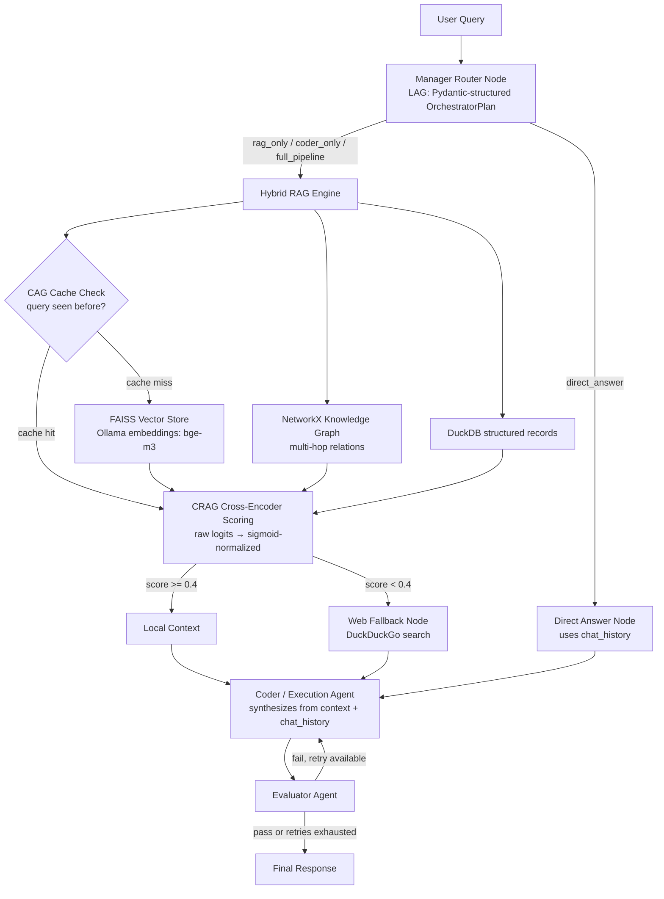

# Agentic-Nexus 🚀

A local-first multi-agent RAG (Retrieval-Augmented Generation) pipeline built with LangGraph, Ollama, LangChain, and LangSmith.

Two mechanisms sit at the core of this architecture:

- **LAG (Language Agent Grammars)** — every inter-agent decision (the Manager's task routing plan) is forced through a Pydantic schema (`OrchestratorPlan` / `SubTask`), not free-form text. This eliminates the class of failures where one agent hands another malformed or unparseable output, and makes the routing decision itself a structured, inspectable object instead of a guess extracted from prose.
- **CAG (Cache-Augmented Generation)** — before any retrieval work happens, the Hybrid RAG path checks a bounded in-memory normalized query→result cache owned by the data engine. Exact normalized repeats skip FAISS retrieval, knowledge-graph lookup, Cross-Encoder reranking, and fallback selection for results already computed in the current process.

On top of these, the system dynamically evaluates retrieval confidence using **CRAG (Corrective RAG)** with a local Cross-Encoder reranker, and combines vector search with a NetworkX knowledge graph for multi-hop context.

## 🏗️ System Architecture & Workflow

### Diagram (rendered)



### Diagram (plain text)

```
[User Query]
     │
     ▼
[Manager Router Node] ──► LAG: Pydantic-structured plan (OrchestratorPlan)
     │                     Routing Strategy: 'direct_answer' | 'rag_only' | 'coder_only' | 'full_pipeline'
     │
     ├─► [Direct Answer Node] (bypasses RAG/Coder, uses chat_history for follow-ups)
     │
     └─► [Hybrid RAG Engine]
               │
               ├─► [CAG Cache Check] (in-memory query→result cache, skips retrieval on repeat queries)
               ├─► FAISS Vector Store (Ollama embeddings: bge-m3)
               ├─► NetworkX Knowledge Graph (multi-hop relations)
               └─► DuckDB structured records
                     │
                     ▼
             [CRAG Cross-Encoder Scoring]
             (raw reranker logits → sigmoid-normalized to 0–1)
                     │
         ┌───────────┴───────────┐
         │ score >= 0.4          │ score < 0.4
         ▼                       ▼
   [Local Context]       [Web Fallback Node] (DuckDuckGo search)
         │                       │
         └───────────┬───────────┘
                     ▼
             [Coder / Execution Agent]
             (synthesizes answer from context + chat_history)
                     ▼
             [Evaluator Agent] ──► fail? ──► retry Coder once with feedback
                     │
                     ▼
             [Final Response]
```

## Key Execution Stages

- **Manager Router — LAG in action** (`manager_node`): The Manager doesn't return free text — it returns a Pydantic-validated `OrchestratorPlan` with typed `SubTask` objects (`assigned_agent: Literal["HybridRAG", "CoderExecution", "DirectAnswer"]`). The graph reads this structured plan directly to route to `direct_answer`, `rag_only`, `coder_only`, or `full_pipeline` — routing is a real branch driven by a schema, not a fixed pipeline or a regex over LLM prose.
- **CAG cache layer** (`run_hybrid_rag_agent` + `CAGDataEngine.query_cache`): Before touching FAISS or the knowledge graph, the agent checks a bounded normalized query→result cache. A hit returns the previously computed hybrid result and avoids retrieval and reranking. The cache is intentionally process-local and resets on restart; Redis would be the natural distributed replacement.
- **Hybrid RAG + CRAG Scoring** (`hybrid_rag_node`): On a cache miss, retrieves from FAISS + the knowledge graph, reranks with `BAAI/bge-reranker-large`, sigmoid-normalizes the raw logits, and only triggers web fallback when normalized confidence is genuinely low (`< 0.4`).
- **Multi-turn state**: `chat_history` is threaded through every node, including the `direct_answer` fast path.
- **Evaluator + bounded retry**: A failed evaluation triggers exactly one regeneration with feedback injected into the Coder's prompt, capped to prevent infinite loops.
- **LangSmith dataset evaluation**: Runs an automated correctness check against a small dataset via Ollama, gracefully skipped (not crashed) if credentials are invalid.

## 🛠️ Project Directory Structure

```
enterprise_agentic_nexus/
├── config.py                      # LLM/embeddings init, LangSmith tracing setup
├── main.py                        # LangGraph workflow definition & test pipeline
├── requirements.txt
├── agents/
│   ├── lag_grammar.py             # LAG: Pydantic OrchestratorPlan / SubTask schema
│   ├── manager_agent.py           # Structured-output routing decision
│   ├── hybrid_rag_agent.py        # FAISS + KG retrieval, CRAG scoring, web fallback
│   ├── execution_coder_agent.py   # Answer synthesis + direct-answer path
│   └── evaluator_agent.py         # Hallucination / correctness check
├── rag_pipeline/
│   ├── data_engine.py             # CAG cache + FAISS vector store + DuckDB
│   └── graph_store.py             # NetworkX knowledge graph
└── evaluation/
    └── langsmith_eval.py          # LangSmith dataset builder + evaluator
```

## 📦 Requirements (`requirements.txt`)

```
# Core Frameworks
langgraph>=0.2.0
langchain>=0.3.0
langchain-core>=0.3.0
langchain-community>=0.3.0
langchain-ollama>=0.2.0

# Vector Store, Graph & DB
faiss-cpu>=1.8.0
networkx>=3.1
duckdb>=1.0.0
duckduckgo-search>=6.0.0

# Reranking / Scoring
torch>=2.2.0
sentence-transformers>=3.0.0

# Evaluation & Observability
langsmith>=0.1.80
pydantic>=2.8.0

# Config
python-dotenv>=1.0.0
```

## ⚡ Quickstart & Installation

### 1. Environment Setup

```bash
git clone https://github.com/your-username/enterprise_agentic_nexus.git
cd enterprise_agentic_nexus

python3 -m venv venv
source venv/bin/activate

pip install --upgrade pip
pip install -r requirements.txt
```

### 2. Ollama Model Setup

```bash
ollama pull bge-m3
ollama pull gemma4:e4b-it   # or your preferred local model — verify with `ollama list`
```

### 3. Environment Variables

Create a `.env` file in the project root (never commit this file — it's already covered by `.gitignore`):

```
LANGCHAIN_TRACING_V2=true
LANGCHAIN_API_KEY=your-langsmith-api-key
LANGCHAIN_PROJECT=enterprise-agentic-nexus
```

`config.py` loads these via `python-dotenv`; nothing sensitive is hardcoded in source.

## 🧪 Running the Pipeline

```bash
python main.py
```

### Example Execution Log

```
Executing Enterprise-Agentic-Nexus Pipeline Test Runs...

-> [Manager Router]: Planned Route Strategy -> 'full_pipeline'
-> [CRAG Scoring]: raw=0.728 -> normalized=0.674

Query 1 Response:
## Language Agent Grammars (LAG) enforce structural outputs by treating
generation as a constrained state machine governed by Pydantic schemas...

CRAG Status: VERIFIED (Score: 0.67)
Evaluator Score: 1/1
======================================================================
-> [Manager Router]: Planned Route Strategy -> 'direct_answer'
-> [Direct Answer Node]: Executing direct response (Bypassing RAG & Coder)...

Query 2 Multi-Turn Response:
We discussed that Language Agent Grammars (LAG) transform an LLM's output
from unstructured text into a validated, typed, deterministic data payload...
```

## 🔍 Observability

All agent calls are wrapped with `@traceable` and reported to LangSmith under the `enterprise-agentic-nexus` project, giving step-by-step visibility into routing decisions, retrieval scores, and evaluator verdicts for every run.
